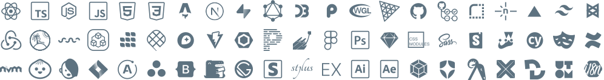
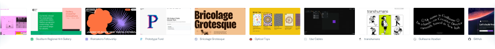

# Hello there! I am Lucas Vogel(ino).

###  To know more about me, visit my portfolio [lucasvogel.click](https://lucasvogel.click)

---

###  Background:

- Half Swiss🇨🇭, half Chilean🇨🇱
- Studies in Multimedia Design _(Lausanne, CH)_ & BA in Interface Design _(Potsdam, DE)_

---

###  Professional Experience:

- Software interface designer and frontend developer, usually building:
- Specialized in pixel perfect UIs that are:
  - Original & Unconventional
  - Easy to Use & Fun to Discover
  - Human & Non-Corporate-Looking
  - Smooth & Slick
  - Fast & Responsive
  - Accessible & SEO-friendly
- Previously worked on complex stacks in SaaS companies such as Nexenio and Ubermetrics Technologies
- In the last three years, worked at Berlin's public sector innovation laboratory ([@technologiestiftung](https://github.com/technologiestiftung)) as a creative technologist, building prototypes and projects for Berlin's citizens and government
- Taught creative coding and data visualization at the University of Applied Science Potsdam (FH Potsdam) as a guest lecturer
- Currently working as a Frontend-Engineer at DeepJudge ([@deepjudge-ai](https://github.com/deepjudge-ai))

---

###  Current Endeavors:
- Moved back to Switzerland after more than a year as a freelance web developer and designer in Santiago de Chile.  **Currently open to job opportunities in Switzerland!** [Contact me now!](mailto:contact@lucasvogel.click)
- Mostly coding and designing software applications and websites
- Enjoying different creative practices like graphic design, ceramics, illustration, and animation

---

###  What I usually build:

- Web Applications
- Websites
- Data Visualizations
- Data Dashboards
- etc.

---

###  The tech stack I most commonly use:

---

###  For a list of cool sites I like and collect, follow this link: [lucasvogel.click/cool-sites](https://lucasvogel.click/cool-sites)

---

###  Here are my RSS feeds:

| [All contents](https://lucasvogel.click/rss.xml) | [Only the pages](https://lucasvogel.click/rss-pages-only.xml) | [Only the projects](https://lucasvogel.click/rss-projects-only.xml) | [Only the cool sites](https://lucasvogel.click/rss-cool-sites-only.xml) |
| :------------------------------------------- | :-------------------------------------------------------- | :-------------------------------------------------------------- | :------------------------------------------------------------------ |

---

###  Here are my socials:

| [ Mastodon](https://techhub.social/@vogelino) | [ LinkedIn](https://www.linkedin.com/in/vogelino/) | [ Dribbble](https://dribbble.com/vogelino) |
| :------------------------------------------------------------------------------ | :----------------------------------------------------------------------------------- | :--------------------------------------------------------------------------- |

---

###  To know more about me, visit my portfolio [lucasvogel.click](https://lucasvogel.click)

---

Looking for the README of my portfolio? It's [here](https://github.com/vogelino/vogelino/blob/main/REPO-README.md).
