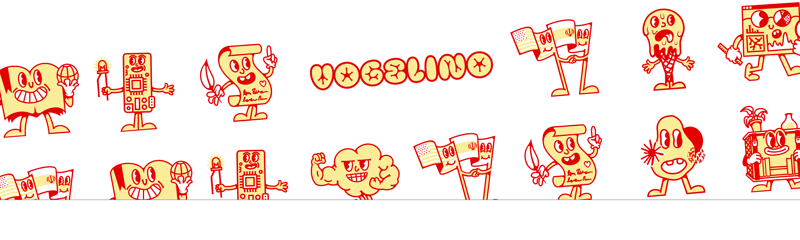

# Hi, Lucas Vogel(ino), at your service...

## What you might want to know about me:

###  Background:

- Half Swiss🇨🇭, half Chilean🇨🇱
- Studies in Multimedia Design _(Lausanne, CH)_ & BA in Interface Design _(Potsdam, DE)_

---

###  Professional Experience:

- Software interface designer and frontend developer, usually building:
- Specialized in pixel perfect UIs that are:
  - Original & Maverick
  - Easy to Use & Fun to Discover
  - Human & Non-Corporate-Looking
  - Smooth & Slick
  - Fast & Responsive
  - Accessible & SEO-friendly
- Previously worked on complex stacks in SaaS companies such as Nexenio and Ubermetrics Technologies
- In the last three years, worked at Berlin's public sector innovation laboratory (CityLAB Berlin), building projects for Berlin's citizens and government
- Taught creative coding and data visualization at the University of Applied Science Potsdam (FH Potsdam) as a guest lecturer

---

###  Current Endeavors:

- Since late 2023, living in Santiago, Chile and working as an independent digital product designer and developer
- Mostly coding and designing software applications and websites
- Enjoy different creative practices like graphic design, ceramics, illustration, and animation

---

###  What I usually build:

- Web Applications
- Websites
- Data Visualizations
- Data Dashboards
- etc.

---

|  To know more about me, visit my portfolio: [vogelino.com](https://vogelino.com)                                                          |
| :----------------------------------------------------------------------------------------------------------------------------------------------------------------- |
|  |
